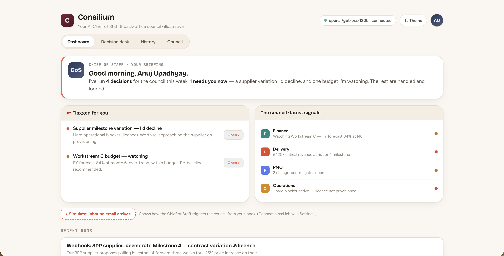
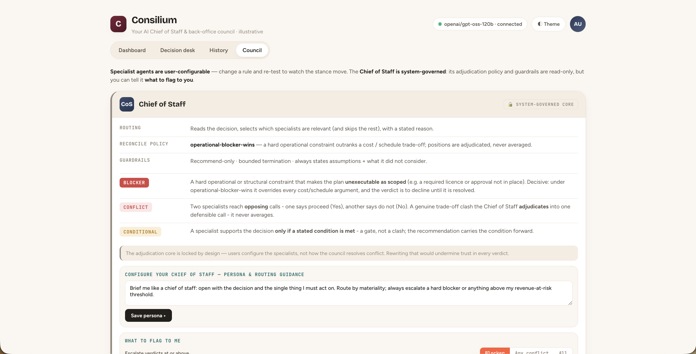
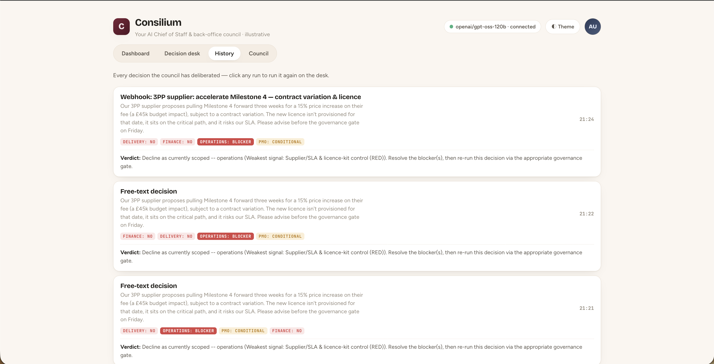
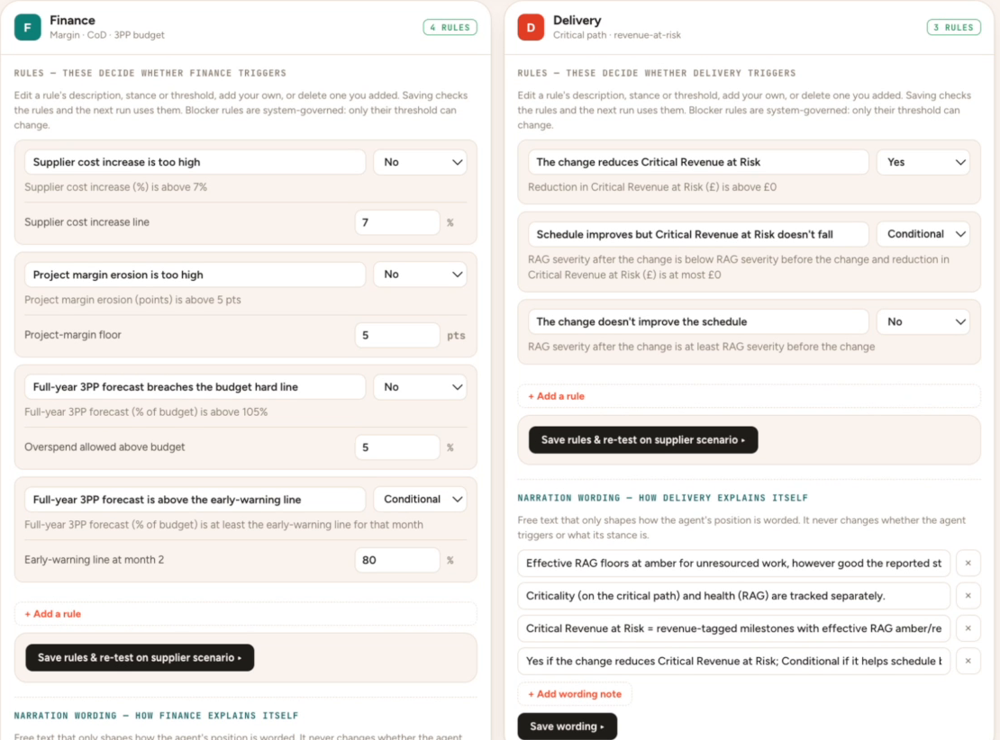

# Consilium

Consilium is a forkable, open-source multi-agent decision framework built around one principle:
**rules decide, the LLM reads and explains.** Every specialist agent checks its own rules against
every decision — none can be left out — and an agent is *triggered* only when one of its rules fires
on stated facts. A **Chief of Staff** then summarises what triggered and reconciles the positions
into one defensible recommendation, with the whole process visible on screen, step by step. It
ships with an illustrative back-office example (Finance, Delivery, PMO, Operations) because that's
a domain most people can sanity-check — a framework showcase, not a product; the agents are
editable config, not hardcoded logic.



*The Dashboard — a Chief of Staff briefing, what's flagged for you, and each specialist's latest
signal at a glance.*

## The problem

A single chatbot asked "should we do this?" collapses cost, schedule, governance, and operational
reality into one undifferentiated answer. Real back-office decisions aren't like that — the
Finance view and the Delivery view can legitimately conflict, and the interesting part is *how*
that conflict gets resolved, not just the final word. Consilium makes that resolution process the
product: you watch the specialists disagree, and you watch a defined policy — not a vibe — decide
what wins.

## How it works

```
message / seed ─► facts   (seed: authored · free text: extracted, every value backed by a verified quote, never estimated)
               ─► EVERY agent checks its rules                 (nothing can be left out)
                    a rule fires            → TRIGGERED: stance, the rule(s) that fired, the evidence
                    no rule fires           → "All rules checked — none tripped", or "No rule triggered" + "Couldn't check: …"
                    keyword mentioned, field not confirmed → "Unclear: …" (tripwire)
               ─► verdict direction (code): a fired blocker wins; an unclear / unchecked blocker field caps it
               ─► Chief of Staff (LLM): wording — the risks, why the brief is a challenge, the conflicts
```

1. **Check.** Each agent's rules live in editable config (`rules[]`: id, fields, a `when`
   expression, a stance). The rules engine is a small whitelist evaluator — no `eval`. A rule fires
   only if *every* field it needs is stated and its condition is true; a rule with an unstated field
   never fires and never guesses, it is reported as "couldn't check". An agent's stance is the most
   severe among the rules that fired (`blocker` > `no` > `conditional` > `yes`).
2. **Explain.** Only triggered agents are narrated: an LLM writes the position up in the agent's
   voice but cannot change the stance — the narration model has no field to put one in.
3. **Reconcile.** The verdict's *direction* is set in code — a fired `blocker` from *any* agent
   overrides a cost/schedule trade-off, and an unconfirmed blocker field caps the verdict. The
   Chief of Staff's model only writes the wording; if its wording contradicts the code, the code's
   direction is what's shown.



*The policy in plain English, not just in code — Blocker, Conflict and Conditional defined the way
the verdict actually uses them.*

**Recommend-only, always.** Nothing Consilium produces writes to a real system. Every verdict ends
with what was assumed and what wasn't considered, and the framework never claims more certainty
than its inputs support.

**Deterministic fallback, always.** Every LLM call — extraction, narration, reconciliation — has a
non-LLM fallback path. No model reachable? A seed runs completely (its facts are authored, so no
extraction is needed) and reconciliation falls back to rule-based logic over the same structured
positions; a free-text brief simply has no stated facts, so no rule fires and the verdict lists what
couldn't be checked. A run never crashes because a model is down, and the UI's **Fallback mode**
indicator makes that state visible rather than silent.

## The standout engineering

- **Code-authoritative blocker enforcement.** When any agent raises a `blocker`, the final
  recommendation line is written by policy in code, not inferred from the model's phrasing. A
  keyword check on the model's own text would be defeatable by negation (*"do not hold back —
  approve"* contains the word "hold" but ships an approval); reconciliation avoids that trap
  entirely by authoring the verdict itself whenever a blocker is present, and confining the model's
  contribution to the *why* and the *trade-off*.
- **No agent can be skipped, so no LLM can silence a blocker.** An earlier design let one LLM
  routing call choose which agents ran; when it left Operations out, Operations' code-enforced
  blocker never fired and the same input returned opposite verdicts on different runs. Routing is
  deleted: every agent is an unconditional graph edge, and whether it triggers is decided by its
  own rules in code.
- **Evidence-quoted facts, no estimates.** Free-text facts are extracted by one narrow LLM call per
  agent over the *whole* message (never chunked). Each value must come with verbatim quotes, and
  *code* verifies every quote is really in the message; a value with missing or unverifiable
  evidence is discarded and the field counts as not stated. No schema defaults, no "reasonable
  estimate" — a brief that never states a figure can't produce a verdict that rests on one.
- **A verdict cap for what wasn't confirmed.** If a blocker-relevant field is *mentioned* (a
  specific keyword like "licence" or "SLA") but not confirmed, the card shows "Unclear" and the
  verdict cannot be better than "proceed only after confirming". If it isn't in the brief at all,
  the verdict may proceed on stated facts, but the panel lists those facts in a separate
  "Not checked — not stated in the brief" block (by plain-English label, grouped by agent, blocker-related
  first; if a blocker fact was mentioned but unconfirmed the block leads with "Confirm first"). Never a
  clean approve resting on silence.
- **A tamper-evident audit ledger on the inbound trigger.** `POST /trigger/webhook` is a real,
  credential-free way to convene the council from an external event (a mail rule, Zapier, `curl`).
  Every call — including a rejected one — is appended to a hash-chained, append-only ledger before
  anything else happens: each entry stores the hash of the previous entry, so editing or deleting
  any past line breaks every hash after it. `/audit.html` is a governance viewer over the same
  chain — it recomputes the chain independently and flips visibly red the moment it's been altered.
- **Agents are edited, not redeployed.** Every agent's rules and numeric thresholds live in
  versioned JSON config, not Python literals. The Council UI edits thresholds live —
  `PUT /agents/{id}/config` validates and persists to that file, and the very next run checks with
  the change. Blocker rules are system-governed: the save endpoint refuses to add, remove or alter
  one, so a UI edit can't quietly delete a safety rule. Plain-English notes still feed the LLM's
  narration prompt, so they change how an agent *explains* itself, never whether it triggers.

## Prerequisites

- **Python 3.10+.**
- **A model — optional.** Consilium is model-optional: with no model reachable it runs every
  decision through its deterministic fallback path, with a **Fallback mode** indicator so that
  state reads as intentional rather than broken. For genuine multi-agent reasoning, point it at any
  OpenAI-compatible endpoint. The simplest local option is [Ollama](https://ollama.com):

  ```bash
  # one-time, in a separate terminal — you run and own this, the app never starts it for you
  ollama serve                 # or launch the Ollama app (keeps the server alive in the menubar)
  ollama pull llama3.2
  ```

  The app deliberately does not start or manage Ollama. Your model server is yours to run;
  Consilium only *connects* to it — start it before or after launching, and Consilium picks it up
  on the next Save/refresh, no restart required.

### Configuration

| Variable | Default | Purpose |
|---|---|---|
| `MODEL_PROVIDER` / `MODEL_NAME` / `BASE_URL` / `API_KEY` | `openai` / `gpt-4o-mini` / — / — | Any OpenAI-compatible endpoint (also settable in **Settings**). |
| `MODEL_CONTEXT_TOKENS` | `8000` | Conservative ceiling on a free-text message's *estimated* size (~3 characters per token, deliberately over-counting). The whole message goes to every agent's extraction call and is never chunked or truncated — a message over this fails with a clear error. Raise it only if your model's context window genuinely allows. |
| `CONSILIUM_DATA_DIR` | `~/.consilium` | Where settings, run history and the audit ledger persist (outside the source tree). |
| `CONSILIUM_WEBHOOK_TOKEN` | unset | If set, `POST /trigger/webhook` callers must send it as `X-Consilium-Token`. |

### Providers & models

Consilium speaks the OpenAI HTTP shape, so any compatible endpoint drops in from **Settings →
Language model** — pick a provider and a sensible default model and base URL fill in automatically
(hosted providers require a key; the base URL is resolved server-side, not trusted from the client):

| Provider | Cost | Default model | Notes |
|---|---|---|---|
| **Groq** | free tier | `openai/gpt-oss-120b` | fast, strong reasoning; a good default for trying this out. Key: console.groq.com. |
| **Anthropic** | paid API credits | a current Claude Sonnet id | most reliable of the hosted options. Key: console.anthropic.com. |
| **OpenAI** | paid | `gpt-4o-mini` | cheap and reliable. |
| **Local (Ollama)** | free | `llama3.2` | fine for wiring checks; a 3B model is often too small for accurate free-text fact extraction. |

**Model quality drives free-text accuracy.** Reading the figures a decision turns on is only as
good as the model doing the reading — a small local model often can't, and the affected fields are
reported as "couldn't check" / "unclear" (and cap the verdict) rather than guessed. Seeds carry
explicit facts and produce grounded verdicts on any model, including the deterministic fallback.

## Setup & run

```bash
python3 -m venv .venv
source .venv/bin/activate
pip install -r backend/requirements.txt
cp .env.example .env   # MODEL_PROVIDER/MODEL_NAME/BASE_URL/API_KEY -- any OpenAI-compatible
                        # endpoint, including a local Ollama server (see .env.example)
```

One command handles all of the above plus Ollama detection and opening the app:

```bash
./start.sh
```

Or run it directly:

```bash
source .venv/bin/activate
uvicorn api.app:app --app-dir backend
```

Open the URL it prints (default `http://localhost:8000`) — the FastAPI app serves both the
frontend and the API from the same origin.

### AI-assisted launch

Don't want to run the commands above yourself? Point an AI coding assistant (Claude Code, Cursor,
etc.) at this repo and ask it to get Consilium running — for example:

> "Clone this repo, set up a Python virtual environment, install `backend/requirements.txt`, copy
> `.env.example` to `.env`, and run `./start.sh` so I can try it in my browser."

The whole point of `start.sh` and the deterministic fallback (no model required, see below) is that
this works with zero manual setup decisions — the assistant can have it running in one pass, and
you can try both a seed scenario and your own free-text decision immediately.

> **Don't add `--reload` for normal use.** The app persists its own state (model config, the
> Chief-of-Staff persona, the audit ledger) to a per-user data directory *outside* the source tree
> (`~/.consilium`, override with `CONSILIUM_DATA_DIR`), specifically so `--reload` is safe if you
> want it for development — but it isn't needed for normal use, and an earlier design that wrote
> settings *into* the source tree would reload the whole process (and drop the in-flight request)
> on every save.

## How to use it

- **Seed scenarios** on the Decision desk are one-click, pre-written dilemmas with engineered
  facts — the fastest way to see a genuine disagreement and a blocker-overrides-trade-off verdict.
- **Free-text decisions** run through the same real pipeline: type your own scenario and every
  agent extracts the facts it needs — with quoted evidence — from your text, then checks its rules.
- **The inbound webhook** (`POST /trigger/webhook`) convenes the council from an external event —
  point a mail rule or `curl` at it — and the resulting decision lands in History exactly like a
  desk run, with every call (accepted or rejected) recorded to the audit ledger first, and the
  per-agent checks table recorded to it afterwards. `/audit.html`
  shows the chain and its verification status. The Dashboard's "Simulate inbound email" button
  exercises the same audited path without needing anything wired up.

  

  *History — every run the council has made, with each specialist's stance and the verdict it led to.*

- **Council** is where you edit the agents: add, edit, or remove a plain-English rule for any of
  the four specialists, adjust a numeric threshold, and re-test live against the seed scenario to
  watch the stance move. Blocker rules are shown read-only ("system-governed"). The Chief of
  Staff's persona (tone and wording guidance only — it can never touch extraction, checks, or
  stances) is editable; its adjudication policy and guardrails are not.

  

  *Finance, Delivery, PMO, Operations — plain-English rules and numeric thresholds, editable live,
  no redeploy. (Screenshot predates the P3.6 rule display.)*

## Testing

```bash
cd backend
pytest
```

207 backend tests, plus 15 real-browser Playwright end-to-end tests that drive the actual served
UI (catching wiring defects — a dead button, a stubbed-not-real connection, state lost on reload —
that backend unit tests structurally can't see). Every LLM call is mocked by default, so the suite
needs no reachable model and runs in a few seconds; specific tests override the mock to verify
genuine LLM-driven behaviour. Regression control for the rules migration is permanent: golden
fact-set files (`backend/tests/golden/`) generated from the original `evaluate()` code pin every
agent's stance and driving constraint, including every threshold edge.

Two suites need a real model and are excluded from a bare `pytest` (`-m live`): the seed
determinism check and the extraction evaluation set —

```bash
cd backend
pytest -m live tests/test_determinism.py      # seed x5 against your configured model
pytest -m live tests/extraction_eval -s       # blocker-field hit rate / false-positive rate
```

The Playwright tests skip cleanly if Playwright isn't installed. To enable them:

```bash
pip install playwright
playwright install chromium
```

## Architecture

LangGraph orchestrates a bounded, two-superstep graph (`every agent in parallel → reconcile`)
with an unconditional edge to every enabled agent — each agent extracts (free text only), checks its
rules, and narrates if triggered, all inside its own node — and no open-ended agent-to-agent loops,
ever. FastAPI streams the run over Server-Sent Events so the frontend renders each agent's check as
it completes rather than waiting for the whole thing. See
[`docs/ARCHITECTURE.md`](docs/ARCHITECTURE.md) for the full technical narrative — the state shape,
the termination guarantees, the config-driven agent design, and why each of the standout-engineering
pieces above is built the way it is.

## Limitations

Consilium is a showcase of a design, on an illustrative domain — not a product.

- **Extraction depends on the model.** Free-text facts are only as good as the model reading them.
  Measured blocker-field hit rate: `[TO BE MEASURED: run pytest -m live tests/extraction_eval]`
  (model to be recorded with it; the 24 evaluation emails' expected answers are still unconfirmed
  by the project owner, so no number is valid until they are).
- **A miss is visible, not silent.** A field the model can't ground in a verified quote is shown as
  "couldn't check" or, when its keyword appears, "unclear" — and an unclear blocker field caps the
  verdict. Weak models, and facts that are only *implied* ("should be fine by then"), will therefore
  show a lot of "couldn't check". That is the expected behaviour, not a failure.
- **Cost.** A free-text run makes one extraction call per agent (four here), plus narration for
  each triggered agent and one reconciliation call. Seeds make no extraction calls.
- **No chunking.** The whole message goes to every agent. A message estimated over
  `MODEL_CONTEXT_TOKENS` fails with a clear error instead of being truncated.
- **Stable direction, varying wording.** Which agents trigger, which rules fire and the verdict's
  direction are decided in code and don't change run to run on the same facts; the wording an LLM
  writes around them does.
- **Illustrative rules.** The four agents' rules and thresholds are examples of what the framework
  can carry, not a claim about how any organisation should decide.

## Fork it

This is a scaffold, not a finished product. Three ways to make it yours:

- **Change the rules, not the code.** Edit `backend/agents/configs/*.json` — thresholds, gate
  names, lens descriptions — and disable/add entries in `backend/agents/manifest.json` to change
  which agents run. No Python changes needed (the Council tab does exactly this, live).
- **Change the reasoning.** Replace `evaluate()` in any `backend/agents/*.py` with your own domain
  logic (and its matching `*Config`/`*Facts` Pydantic models), or add a wholly new agent kind and
  register it in `backend/agents/registry.py`'s `AGENT_KIND_REGISTRY`. A JSON file alone can
  parameterise existing logic; a genuinely new *kind* of reasoning needs this step.
- **Change the model.** Any OpenAI-compatible endpoint works via `.env` or the Settings tab —
  OpenAI, Anthropic, Groq, OpenRouter, or a self-hosted OSS model.

## Licence

MIT — see [LICENSE](LICENSE).
